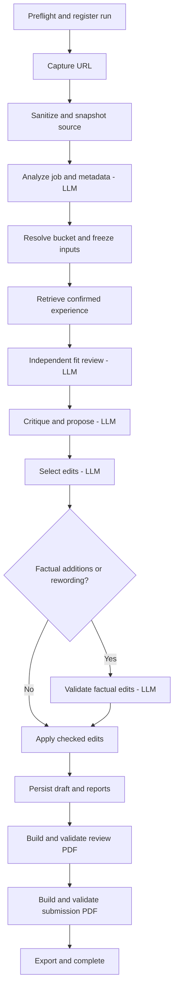

# LangGraph URL-to-Resume Pipeline

Date: 2026-09-10
Status: Proposed specification; implementation is not included.

## 1. Objective

Accept one public job-posting URL and automatically run the complete resume
tailoring pipeline: capture the posting, select a base resume, retrieve confirmed
experience, assess fit, propose and validate changes, save an immutable draft,
generate both PDFs, and return an inspectable result.

Use LangGraph as a deterministic workflow runtime. Python controls transitions;
LLMs perform bounded content tasks. There is no model coordinator, autonomous
planner, or agent loop selecting tools. Skills are optional interface instructions,
not the source of execution order or enforcement.

Successful completion means both the sanitized review PDF and private submission
PDF pass their respective local validation checks. It does not mean human approval,
publication, or submission to an employer.

## 2. Scope and Design Decisions

- Use a typed LangGraph `StateGraph` with local durable checkpointing.
- Preserve existing Pydantic response contracts, specialist prompts, privacy
  gateway, evidence checks, knowledge store, application records, and renderer.
- Replace the coordinator loop rather than wrapping it in a graph node.
- Use direct graph invocation from the CLI and the URL-specific Discord path.
- Default to automatic restricted browser fallback when ordinary extraction fails
  and browser support is configured. Never use a logged-in browser profile.
- Complete supported drafts without asking questions about optional experience.
  Unconfirmed opportunities are reported separately and excluded from resume text.
- Block on essential missing information; never invent facts to finish a run.
- Keep explicit approval, submission recording, Notion publication, interviews,
  and monthly learning outside this graph. Existing commands remain available.
- Do not add model PDF review, hosted orchestration, or cloud tracing in this scope.

The alternatives are a single graph node around the old pipeline, which retains
redundant coordinator calls and offers coarse recovery, or a model-driven graph
router, which adds unnecessary reasoning. Explicit stage nodes provide useful
checkpoint boundaries while preserving deterministic execution.

## 3. Interface and Outcomes

Normal invocation remains `job-companion resume URL`. The URL is the only required
per-run input after local setup of confirmed facts, base resumes, private identity,
model access, and renderer. Configuration is not inferred by a model.

Provide `job-companion pipeline-status RUN_ID` and
`job-companion pipeline-resume RUN_ID`. Resume accepts an optional structured
resolution file for a documented blocker, such as company/role metadata or a valid
bucket ID. It must not accept arbitrary graph-state patches. Existing `--company`,
`--role`, and `--bucket` options remain explicit overrides.

Preserve `--draft-only` as an opt-out: its outcome is `draft_ready`, never complete.
The existing `--browser` flag continues to request browser support; a configuration
setting may disable automatic browser fallback for deployments that require it.

Each invocation returns a typed result containing:

- `run_id`, nullable `application_id` and `version_id` until allocated.
- `status`: `running`, `blocked`, `failed`, `draft_ready`, or `completed`.
- Current stage, safe issue codes, warnings, and any required resolution fields.
- Sanitized report/review-artifact references and an opaque submission-artifact ID.
- Review and submission build states: `pending`, `passed`, or `failed`.
- Cumulative model attempts, token usage when known, cost, and stage latency.

`blocked` means an actionable condition prevents progress; `failed` means a
nonrecoverable run error or incompatible persisted state. No error response may
echo private fields, provider bodies, compiler output, or private filesystem paths.

## 4. Graph Topology

Every node also has explicit bounded failure handling. Essential-data blockers
interrupt the graph; recoverable operational failures retain the last valid
checkpoint. The diagram shows the normal path, not exception edges.

| Stage | Required behavior |
| --- | --- |
| Preflight | Validate setup and URL syntax; check renderer availability for full runs before paid calls; allocate a stable run ID. |
| Capture | Reuse validated HTTPS intake, redirect checks, limits, and restricted browser fallback. Login, challenge, private destination, or unreadable page produces a blocker. |
| Sanitize | Store original source privately; provide only sanitized extracted text to subsequent model nodes. Freeze retrieval metadata and source hash. |
| Analyze | Extract cited requirements and choose a bucket using the existing analyst. Extend its schema to derive missing company/role with source citations in the same call; explicit overrides take precedence. Validate citations locally. |
| Resolve | Block if essential metadata remains missing or bucket confidence is low without an override. Allocate/reuse the application record, freeze the base body, template, prompt/config versions, and writing rules. |
| Retrieve | Retrieve against the selected bucket and job requirements. Include all active confirmed facts referenced by the base; block if any base reference is inactive or unavailable. Freeze the bounded evidence snapshot. |
| Independent review | Assess the original base against the job before seeing critique or edits; preserve this separation in its payload. |
| Critique | Produce supported proposals and separate unconfirmed opportunities, grounded in retrieved facts and cited requirements. |
| Edit | Select proposal IDs, replacements, and ordering using the existing structured contract. |
| Factual validation | Required when selected edits add or reword factual content. Validate exact selected text against confirmed evidence. Require one check per applicable proposal. |
| Apply | Reuse local edit validation for evidence ownership, chronology, references, and exact replacement/proposal agreement. Preserve the original body if factual review rejects any selected factual change; report excluded changes. |
| Persist | Save the immutable draft, analysis, assessment, proposals, usage references, and frozen template before rendering. |
| Review build | Render sanitized inputs with placeholders and independently validate the result. Persist successful artifacts immediately. |
| Submission build | Insert private identity locally and independently validate the private PDF. Never send private render inputs or diagnostics to a model. |
| Export | Export only allowlisted sanitized artifacts; mark complete only after both builds pass and all required records/exports are committed. |

No-change drafts still produce reports and PDFs. A draft with excluded unsupported
edits may complete with warnings if its retained content and both PDFs validate.
There is no automatic model-driven layout-repair loop in this version.

## 5. State and Persistence

Graph state contains serializable typed values: run/application/version IDs,
pipeline schema version, status, sanitized source reference/hash, sanitized metadata,
bucket ID, immutable input snapshot references, specialist outputs or private-store
references to them, applied body reference, attempt counters, safe issues, pending
resolution, and artifact IDs/build states.

Keep clients, credentials, private identity, raw source, PDF bytes, compiler logs,
and filesystem handles out of graph state. Nodes obtain trusted services through
runtime dependencies. Build each model payload explicitly from allowlisted fields;
never serialize the entire graph state into a model request.

Use the local SQLite LangGraph checkpointer with a database under the existing
private store. Use `run_id` as the LangGraph thread ID. Checkpoints are sensitive
local records even when their text is sanitized. Disable external state tracing.
Select and lock compatible LangGraph/checkpointer versions during implementation.

The application store remains authoritative for facts, versions, artifacts,
approvals, and spend. Checkpoints own execution position; they do not replace the
application database. Store a pipeline version and reject incompatible resumes
with a safe error rather than silently interpreting old state under new code.

Freeze source, base, evidence, prompt text, and relevant configuration before their
first dependent model call. Resume uses those snapshots. Fact corrections or new
feedback require a new linked revision run; they cannot silently alter an existing
run or an approved artifact.

## 6. Recovery, Replay, and Idempotency

- Give each request a stable idempotency key. Discord uses message ID; CLI retries
  use run ID. Same delivery returns/resumes the existing run. A new deliberate
  refresh creates a new run and recaptures the URL; URL alone is not identity.
- Preserve existing content-based application deduplication after extraction.
  Concurrent runs resolving to the same application must serialize writes and
  reuse matching persisted versions rather than create duplicates.
- Hold a per-run execution lock; take existing application locks for shared writes.
- Key version creation by run ID and artifacts by version, build kind, and input
  fingerprint. Replayed persistence/export nodes must return existing matching
  results, not create versions or overwrite immutable artifacts.
- Separate model calls from persistence/render nodes. Record validated model
  results in a durable stage-result ledger keyed by run, stage, and input hash.
  A node replay reuses a committed result before making another provider request.
- A crash after provider execution but before result persistence can still lose a
  result. Do not claim exactly-once model execution; account conservatively for
  that attempt before any reissue.
- Keep interrupt nodes free of preceding side effects because resumption can
  reexecute node code. Validate supplied resolutions before continuing.
- A failed submission build preserves the successful review build and draft.
  Resume reruns only the missing/failed build and subsequent export.
- Freeze private render inputs in the private artifact system using fingerprints.
  Changed identity/template/body inputs require a new artifact version and fresh
  validation; they must not overwrite existing approved/submitted files.

## 7. Attempts, Budgets, and Errors

Normal execution uses four model calls (analyst, reviewer, critic, editor), plus
one conditional factual-validator call. Metadata extraction shares the analyst
call. There are zero coordinator calls, including at finish.

Retain the configured per-application dollar budget across revisions and resumes.
Add an explicit total model-attempt cap, default seven per run: up to five normal
calls plus one repair attempt and one escalation attempt shared across the run.
Count every provider attempt, including failures, retries, and escalations. Remove
`coordinator_turns`; migrate `specialist_calls` to the new explicit attempt setting
and document its changed semantics. Keep the graph recursion limit as a separate
defensive guard, not a spending control.

Before every model request, atomically reserve its conservative maximum cost in
the durable budget ledger and record the attempt. Settle against provider usage when
available; charge the reservation when usage is unknown. Persist usage even if the
graph never reaches draft creation. Resume never resets spend or retry allowances.
Before application allocation, the run owns a provisional budget with the same
configured cap. On application resolution, atomically attach its charges and
reservations to the application budget, including any prior application spend.
If the combined spend leaves insufficient budget, block before further calls.
Never discard provisional charges when deduplicating applications.

Schema/content validation failures may consume the one repair attempt, then the
one escalation attempt using the configured escalation route. Provider transient
errors may consume these same bounded allowances; access/configuration errors do
not retry automatically. Keep SDK retries disabled and avoid an additional
LangGraph retry layer that would bypass accounting. Privacy failures, budget/call
exhaustion, unavailable required facts, and unsupported URL challenges block.
Unexpected code/state errors fail with a safe diagnostic ID.

Rendering and extraction have independent finite limits and make no LLM calls.
After their bounded execution fails, return a blocker; do not loop automatically.
Budget increases require an explicit trusted local configuration/action and remain
visible in the ledger. A capped run is never silently restarted as a fresh budget.

## 8. Integration and File Responsibilities

| File | Change |
| --- | --- |
| `src/job_companion/pipeline.py` (new) | Typed state, deterministic graph topology, compilation, start/resume/status interface. |
| `src/job_companion/pipeline_nodes.py` (new) | Stage adapters composing existing business logic with explicit payloads and safe outcomes. |
| `src/job_companion/pipeline_store.py` (new) | Checkpointer lifecycle, run/result/attempt records, idempotency, and execution locks. |
| `src/job_companion/orchestrator.py` | Extract/reuse validators; retire the coordinator loop after migration. |
| `src/job_companion/service.py` | Reusable snapshot/persist operations; route URL pipeline through graph without recursively calling the old orchestrator. |
| `src/job_companion/agents.py`, `contracts.py`, `model_gateway.py` | Retain specialist calls; remove coordinator routing; extend cited metadata contract and durable budget integration. |
| `src/job_companion/assembly.py` | Expose independent review/submission build operations that preserve partial success. |
| `src/job_companion/cli.py` | URL start, status, resume, typed results, and existing override compatibility. |
| `src/job_companion/discord_bot.py` | Route authorized single-URL requests directly to the pipeline; report safe status and opaque run IDs. |
| `src/job_companion/config.py`, `config/`, `pyproject.toml`, `requirements.lock` | Dependency pins, browser policy, graph storage and attempt configuration migration. |
| `src/job_companion/migrations/` | Add run, attempt, result, and unique idempotency records without rewriting historical data. |
| `README.md` | Document URL pipeline, prerequisites, completion states, and recovery commands. |

For Discord, preserve the configured user/channel/mention checks. A message with
exactly one URL enters this workflow without Codex mediation. Multiple URLs return
an input error; batching is outside scope. Unrelated messages may retain the
existing Codex route. Add explicit status/resume commands; generic chat must not
patch state, approve documents, or receive private PDFs automatically. Execute
blocking pipeline work outside the Discord event loop and persist progress so a
bridge restart does not erase the run. Recovery is explicit, not an unattended
background scheduler in this scope.

Legacy text drafting and revision commands must continue to work. They can enter
the same graph after capture with validated sanitized source/snapshots; retain
their input contracts. They must not preserve a second model coordinator path.

## 9. Acceptance and Verification

1. One public URL with adequate metadata and configured prerequisites produces an
   immutable draft, reports, and two validated PDFs without intermediate questions.
2. The happy path makes exactly four or five model requests and zero coordinator
   requests. Model call payloads are bounded and do not include full graph state.
3. Missing metadata uses cited analyst output; unresolved metadata or uncertain
   bucket selection blocks with a typed resolution contract and resumes correctly.
4. Unsupported opportunities never enter the resume. Rejected factual edits retain
   the original body and surface warnings. Cross-employer evidence is rejected.
5. An unreadable/login-protected URL returns a blocker without requesting pasted
   job text as the normal workflow or inventing source content.
6. Restart after each committed stage reuses its result. Crash-window tests cover
   provider-result loss, conservative charging, and prevention of budget reset.
7. Every retry increments the attempt ledger; the seventh attempt and dollar cap
   are enforced across process restarts and concurrent invocations.
8. Duplicate deliveries and replayed persist/export nodes do not create duplicate
   versions or overwrite artifacts; intentionally refreshed URLs can create new runs.
9. A submission-render failure preserves the review PDF. Resume does not rerun
   analysis, critique, editing, or successful review rendering.
10. Protected canaries do not reach model payloads, public exports, chat responses,
    or external tracing. Private artifacts remain locally resolved opaque IDs.
11. Completion requires both build validations and committed exports. Draft-only,
    blocked, failed, and completed states cannot be confused with human approval.
12. Existing approval/submission, privacy, evidence, and immutable-history tests pass.

Use fake specialist responses, fixture HTTP intake, temporary SQLite checkpoints,
and injected crash boundaries for default tests. Add graph unit tests and restart/
duplicate-delivery integration tests. Run actual Docker PDF validation separately
and inspect both documents; mocked rendering is not proof of final layout quality.
Live model evaluation uses approved sanitized fixtures and reports quality, actual
tokens, latency, and cost. Do not assume a particular dollar saving from call counts.

## 10. Delivery Sequence

1. Add typed state, local persistence, durable attempt accounting, and replay tests.
2. Build the deterministic content graph using current specialists and validators;
   remove model coordinator calls and verify parity with existing draft behavior.
3. Integrate URL capture, metadata resolution, input snapshots, and typed blockers.
4. Split rendering into resumable independent builds; integrate final exports.
5. Connect CLI and Discord URL entry points, preserve legacy commands, document
   configuration migration, and run end-to-end acceptance checks.

This document specifies the target design. It does not authorize publishing,
submitting applications, changing confirmed facts, or replacing historical artifacts.
